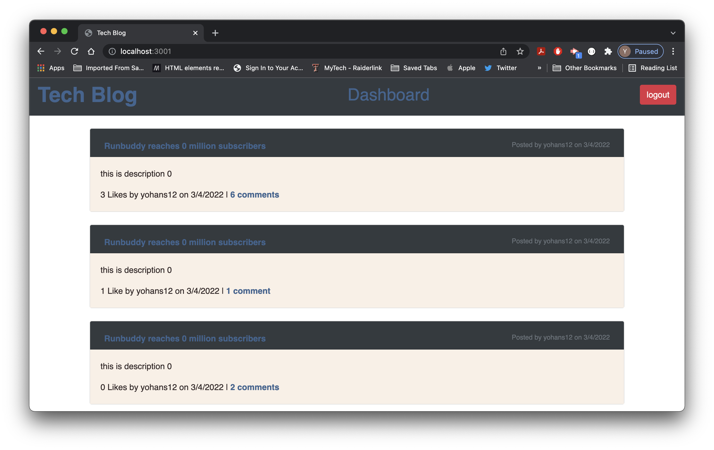

# Tech-Blog

## Description

This is where you can find the best tech news, post your tech blog and get like by many other tech users with the freedome of updating and deleting your post.
This app is built using HTML, CSS, js, node.js, express.js, MySQL, handlebars, and Heroku to post technical news the app was designed based on the MVC model.

## Table of Contents

- [Installation](#installation)
- [Usage](#usage)
- [Snapshot](#snapshot)
- [Questions](#questions)

## Installation

follow the url

## Usage

post your blog here

[live URL](https://yohans14.github.io//)

## Snapshot

## Contributing

If you like to contribut for this project please follow The Contributor Convenant guidelines.

## Questions

If you have any questions.

Yohans Getaneh

GitHub: https://github.com/yohans14

Email: yohans14@yahoo.com
